# Development Journal

A weekly journal describing the progress of the project.

---

## Week 05: Project ideation and planning

- Reviewed several potential project ideas: portfolio generator, job listing matcher, source citation checker, academic language editor, RAG-based course book chatbot, and a mathematical formula digitisation tool
- Selected the GitHub AI Project Manager & Portfolio Generator as it practically combines GitHub integration, AI, and microservice architecture
- Drafted the project plan: defined core features, technology stack, and MVP scope
- MVP was scoped to three core functions: commit analysis, automatic README updates, and portfolio generation — broader features deferred to later versions
- Agreed on a preliminary division of responsibilities: backend, frontend, AI integration, and deployment

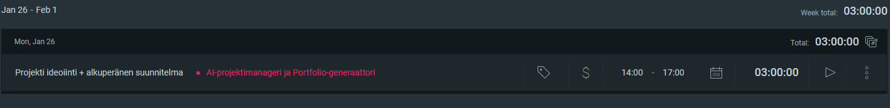

---

## Week 06: Project foundation and GitHub API exploration

- Initialised the project folder structure on GitHub and created a repository for collaborative development
- Explored the GitHub REST API and investigated how an API connection could be established and used in the project
- Studied token-based authentication for API calls and how to configure it
- Outlined the microservice architecture structure to fit the project's needs

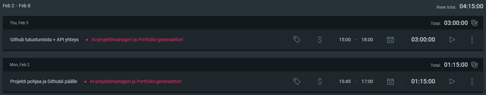

---

## Week 07: Microservice architecture and analysis service

- Continued exploring the GitHub API — investigated in practice how requests are constructed and authenticated
- Studied the structure of API responses and what data can be retrieved from repositories
- Made the architectural decision to implement the project as four separate microservices for clear separation of responsibilities
- Started designing and building the first microservice: the analysis service
- Defined the analysis service's role in the overall architecture — it is responsible for producing AI-powered analysis from GitHub data

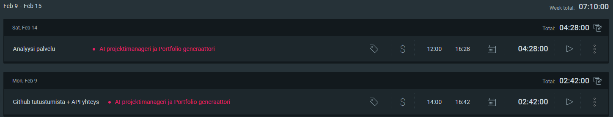

---

## Week 08: Backend services completed and database design

- Built the basic structure of the docs service and portfolio service — both were brought to a working state
- All four backend microservices (GitHub, analysis, docs, and portfolio service) were finalised — the core structure works across all of them
- Discussed database requirements and determined what data needs to be stored and how
- Designed the database schema for the project's needs and began implementing it with SQLite
- A significant week for the overall project — the entire backend layer took shape as a functional whole

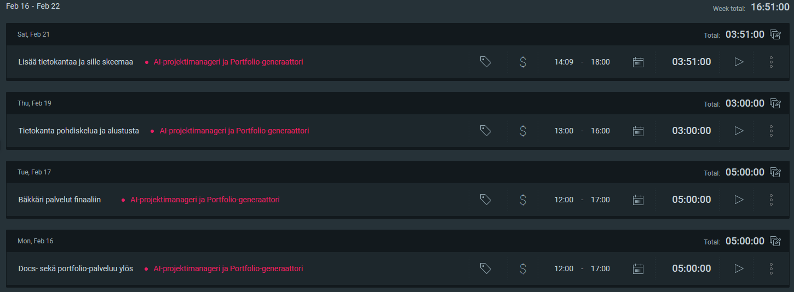

---

## Week 09: Database integration across all services

- Integrated the database into the GitHub service — the service can now store and retrieve data from SQLite
- Added database integration to the analysis service — AI analyses are now persisted
- Added database integration to the docs service — generated documentation is now persisted
- Added database integration to the portfolio service — portfolio descriptions are now persisted
- All four microservices now use a shared SQLite database through a common module

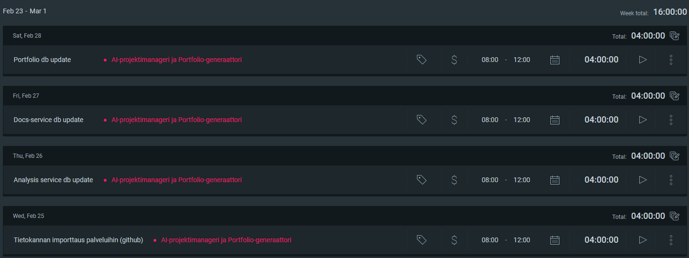

---

## Week 10: Docker persistence, issues integration, and backend MVP complete

- Got Docker working with the database — previously the application only ran locally; now the database persists across container restarts via a Docker volume
- Updated the README and Docker configuration to reflect the updated structure
- Integrated Heidi's issues functionality into the backend — the GitHub service now also fetches and stores repository issues
- Implemented the next steps feature in the analysis service — a new endpoint that asks Gemini to analyse the project's state and suggest concrete next development steps
- Added a status endpoint to the GitHub service — reports whether analyses have been performed for a repository and how many
- Backend MVP complete: all four microservices work with the database, run in Docker, and all planned features are implemented
- Started writing the project report — first content added to the architecture and methods documents

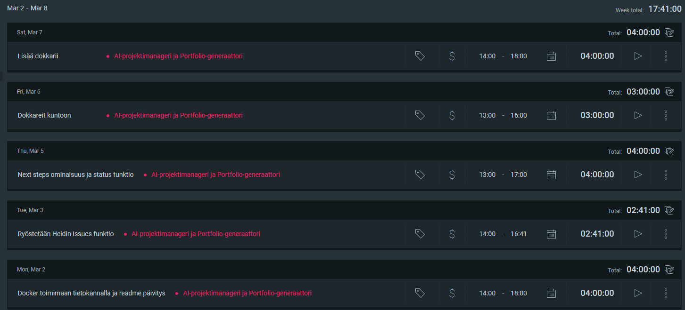

---

## Week 11: Continuing documentation

- Continued writing the project report — expanded the architecture and methods documents
- Added README files to the project to clarify the structure and setup process
- Report content was extended and filled out further

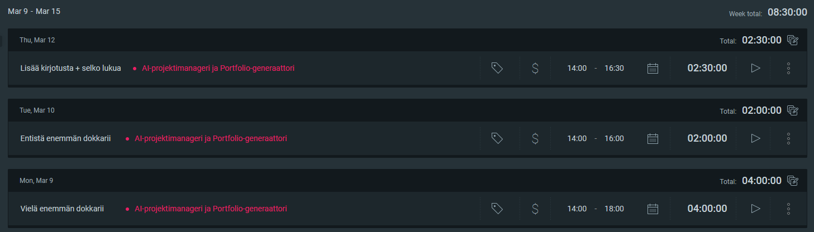

---

## Week 12: Deepening the report and initial results

- Wrote content for the data sources and discussion documents
- Began reflecting on results obtained — outlined what the project has produced and how to present the outcomes
- Filled in additional sections of the report with further content

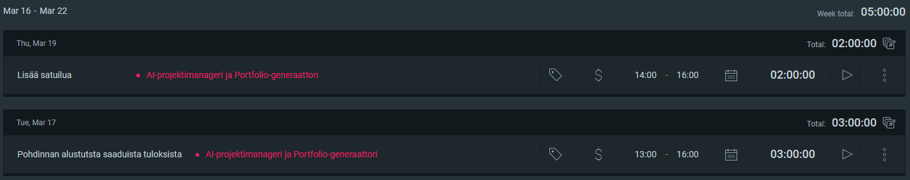

---

## Week 13: Report finalisation, test data collection, and test files

- Brought the data sources, architecture, methods, and discussion documents close to completion and pushed them to GitHub
- Updated README files and ensured all files were in place
- Ran all test files and collected test data for documentation — database row counts, test pass results, and AI output quality
- Performed manual curl tests against live containers using several repositories (`torvalds/linux`, `facebook/react`, `microsoft/vscode`)
- Results were recorded in the project results document

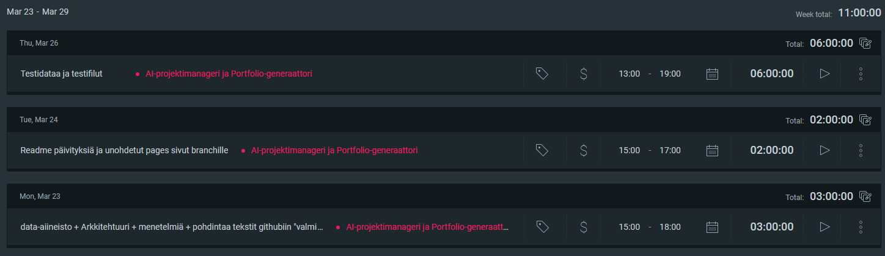

---

## Week 14: Video presentation preparation and results

- Created presentation slides for the upcoming video presentation — covering the project structure, architecture, and backend implementation
- Filled in the results document with test run data — recorded database row counts, test pass results, and lengths of AI-generated content

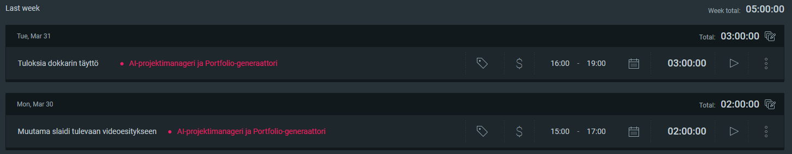

---

## Week 15: Project final demo

- Recorded the video presentation — Joni walked through the project introduction, architecture, and backend implementation using slides, while Heidi demonstrated the Streamlit frontend
- The project was brought to completion

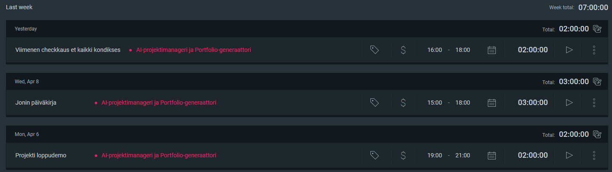

---