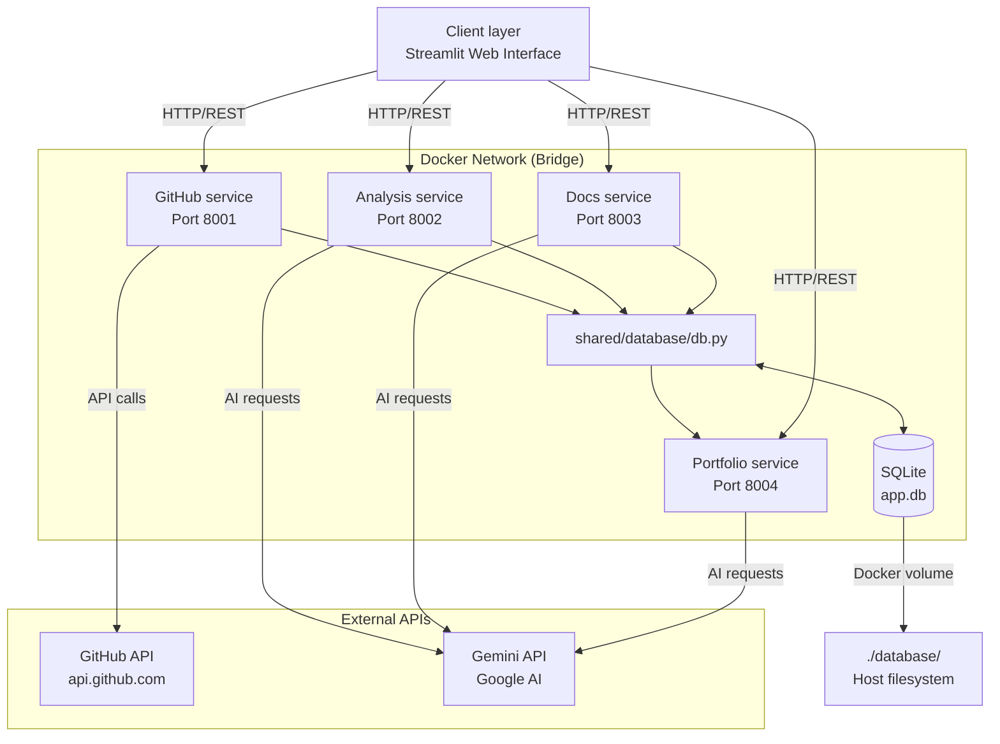
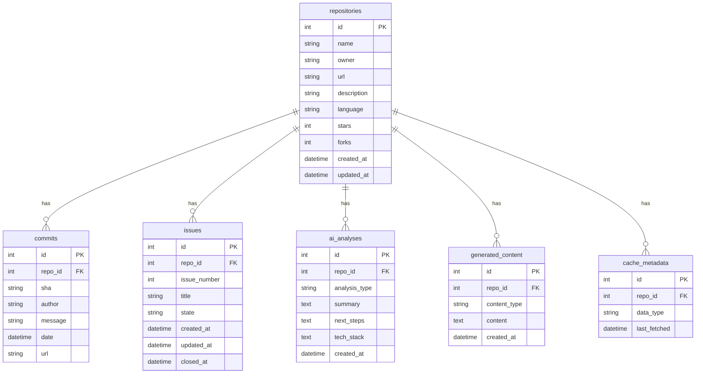
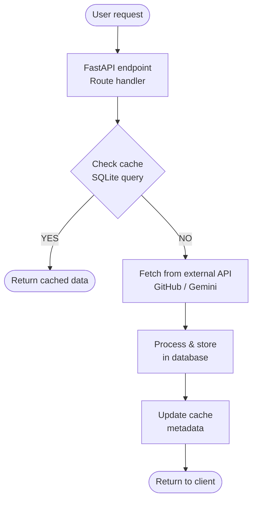
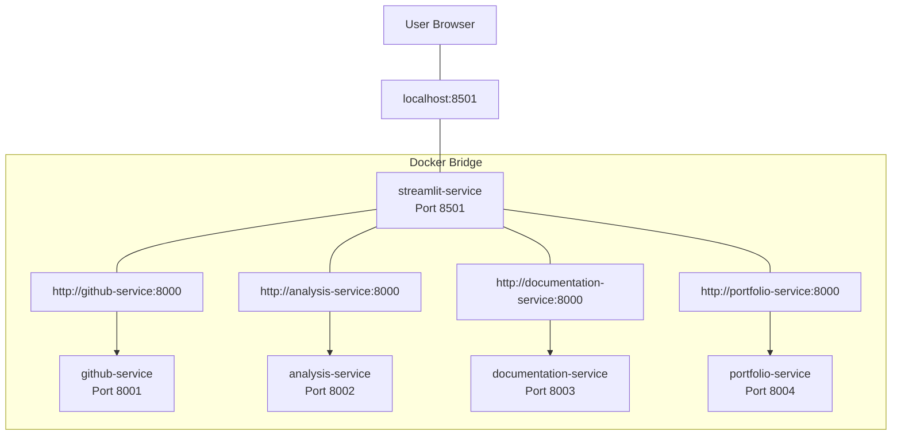
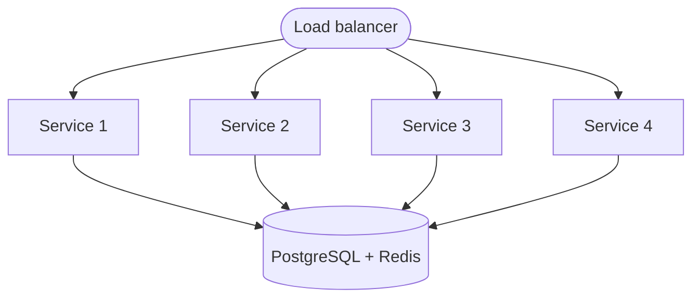

# **Project Architecture**

---
## Table of Contents

1. [Introduction](#introduction)
2. [System Overview](#system-overview)
3. [Microservices Architecture](#microservices-architecture)
4. [Shared Components](#shared-components)
5. [Communication Patterns](#communication-patterns)
6. [Data Flow Architecture](#data-flow-architecture)
7. [Deployment Architecture](#deployment-architecture)
8. [Technology Choices and Rationale](#technology-choices-and-rationale)
9. [Performance and Scalability](#performance-and-scalability)
10. [Security Architecture](#security-architecture)
11. [Testing Strategy](#testing-strategy)
12. [Monitoring and Observability](#monitoring-and-observability)

---
## 1. Introduction

### 1.1 Purpose
This document describes the technical architecture of the AI Project Manager & Portfolio Generator. The architecture follows a microservices pattern with four independent FastAPI services, shared database access, and AI-powered analysis capabilities.

### 1.2 Architectural Goals
- **Modularity**: Independent services with clear responsibilities
- **Scalability**: Horizontal scaling potential for individual services
- **Maintainability**: Clean separation of concerns and shared components
- **Performance**: Intelligent caching to minimize external API calls
- **Deployability**: Containerized services with Docker Compose

### 1.3 Scope
This architecture document covers:
- Service decomposition and responsibilities
- Inter-service communication patterns
- Database design and shared modules
- Deployment configuration
- Security considerations

---
## 2. System Overview

### 2.1 High-Level Architecture


### 2.2 Component Summary

| Component | Type | Responsibility | Technology |
|-----------|------|----------------|------------|
| GitHub Service | Microservice | External data acquisition | FastAPI, httpx |
| Analysis Service | Microservice | AI-powered analysis | FastAPI, Gemini API |
| Docs Service | Microservice | Documentation generation | FastAPI, Gemini API |
| Portfolio Service | Microservice | Portfolio descriptions | FastAPI, Gemini API |
| Streamlit Frontend | Web Application | User interface, state management, service orchestration | Streamlit, Python |
| Shared Database | Module | Centralized data access | SQLite, Python |
| SQLite Database | Data Store | Persistent storage | SQLite 3 |
| Docker Network | Infrastructure | Service communication | Docker Bridge |

---
## 3. Microservices Architecture

### 3.1 Service Breakdown

#### 3.1.1 GitHub Service (Port 8001)

| Attribute | Details |
|-----------|---------|
| **Primary Responsibility** | External data acquisition and caching |
| **Internal Dependencies** | Shared database module |
| **External Dependencies** | GitHub REST API v3 |
| **Technology Stack** | FastAPI 0.109.0, httpx 0.26.0, SQLite |

**Key Functions:**

| Function | Description | Cache Duration |
|----------|-------------|----------------|
| `get_repo_info()` | Fetch repository metadata | 24 hours |
| `get_commits()` | Retrieve commit history | 1 hour |
| `get_issues()` | Fetch repository issues | 1 hour |
| `get_repo_structure()` | Analyze file structure and technologies | No cache |
| `get_repo_by_id()` | Database lookup by repo ID | Instant |
| `get_analysis_status()` | Check analysis completion status | Instant |

**API Endpoints:**
```
GET  /                              # Health check
GET  /repos/{owner}/{repo}/info     # Repository metadata
GET  /repos/{owner}/{repo}/commits  # Commit history
GET  /repos/{owner}/{repo}/issues   # Repository issues
GET  /repos/{owner}/{repo}/structure # Technology detection
GET  /repos/id/{repo_id}            # Lookup by database ID
GET  /status/{repo_id}              # Analysis status
```

**Data Flow:**
```
User Request → Check Cache → GitHub API → Transform → Save to DB → Update Cache → Return
```

---

#### 3.1.2 Analysis Service (Port 8002)

| Attribute | Details |
|-----------|---------|
| **Primary Responsibility** | AI-powered project analysis and insights |
| **Internal Dependencies** | Shared database module, GitHub Service |
| **External Dependencies** | Google Gemini 2.5 Flash API |
| **Technology Stack** | FastAPI 0.109.0, google-generativeai 0.3.2, httpx |

**Key Functions:**

| Function | Description | AI Prompt Type |
|----------|-------------|----------------|
| `analyze_commits()` | Summarize recent development activity | Commit pattern analysis |
| `analyze_project()` | Generate project description | Project overview |
| `analyze_next_steps()` | Suggest actionable improvements | Recommendation engine |
| `get_analysis()` | Retrieve stored analyses | Database query |

**API Endpoints:**
```
GET  /                                    # Health check
GET  /analyze/commits/{owner}/{repo}      # Commit analysis
GET  /analyze/project/{owner}/{repo}      # Project description
GET  /analyze/next-steps/{owner}/{repo}   # Next steps suggestions
GET  /analysis/{repo_id}                  # Get stored analysis
```

**AI Prompt Strategy:**

| Analysis Type | Input Data | Prompt Structure | Output Format |
|--------------|------------|------------------|---------------|
| Commit Analysis | Recent 30 commits | "Analyze these commits and summarize..." | Natural language summary |
| Project Analysis | Repo metadata + structure | "Describe this project professionally..." | Structured description |
| Next Steps | Commits + issues + structure | "Suggest 3-5 actionable improvements..." | Numbered list |

**Data Flow:**
```
User Request → GitHub Service (fetch data) → Format AI Prompt → Gemini API → Parse Response → Save to DB → Return
```

---

#### 3.1.3 Documentation Service (Port 8003)

| Attribute | Details |
|-----------|---------|
| **Primary Responsibility** | AI-powered documentation generation |
| **Internal Dependencies** | Shared database module, GitHub Service, Analysis Service |
| **External Dependencies** | Google Gemini 2.5 Flash API |
| **Technology Stack** | FastAPI 0.109.0, google-generativeai 0.3.2, httpx |

**Key Functions:**

| Function | Description | Cache Duration |
|----------|-------------|----------------|
| `generate_readme()` | Create complete README.md | 7 days |
| `update_readme()` | Generate "Recent Updates" section | 6 hours |
| `get_content()` | Retrieve stored documentation | Instant |

**API Endpoints:**
```
GET  /                                  # Health check
GET  /generate/readme/{owner}/{repo}    # Full README generation
GET  /update/readme/{owner}/{repo}      # Recent updates section
GET  /content/{repo_id}                 # Get stored content
```

**README Generation Strategy:**
```
1. Fetch repository info (GitHub Service)
2. Fetch project structure (GitHub Service)
3. Fetch AI analysis (Analysis Service)
4. Aggregate into structured prompt:
   - Project name and description
   - Features (from analysis)
   - Technologies (from structure)
   - Installation (template)
   - Usage (template)
   - Contributing (template)
5. Send to Gemini API
6. Format as Markdown
7. Store in database
8. Return to user
```

---

#### 3.1.4 Portfolio Service (Port 8004)

| Attribute | Details |
|-----------|---------|
| **Primary Responsibility** | Professional project descriptions for portfolios |
| **Internal Dependencies** | Shared database module, GitHub Service, Analysis Service |
| **External Dependencies** | Google Gemini 2.5 Flash API |
| **Technology Stack** | FastAPI 0.109.0, google-generativeai 0.3.2, httpx |

**Key Functions:**

| Function | Description | Use Case |
|----------|-------------|----------|
| `generate_project_description()` | Single project portfolio entry | LinkedIn, personal website |
| `generate_portfolio()` | Multi-project portfolio | Complete portfolio page |
| `get_portfolio()` | Retrieve stored descriptions | Quick access |

**API Endpoints:**
```
GET   /                                 # Health check
GET   /generate/project/{owner}/{repo}  # Single project description
POST  /generate/portfolio               # Multi-project portfolio
GET   /portfolio/{repo_id}              # Get stored portfolio
```

**Portfolio Description Strategy:**

- **Tone**: Professional, achievement-focused
- **Length**: 150-300 words per project
- **Format**: Paragraph style (suitable for LinkedIn)
- **Content**: Technologies, impact, key features

---

## 4. Shared Components

### 4.1 Database Module (shared/database/db.py)

| Attribute | Details |
|-----------|---------|
| **Purpose** | Centralized database access for all services |
| **Location** | `shared/database/db.py` |
| **Shared By** | All 4 microservices |
| **Technology** | SQLite 3, Python 3.11 |

**Key Functions:**

| Function | Purpose | Returns |
|----------|---------|---------|
| `init_database()` | Create tables and indexes | None |
| `get_db_connection()` | Get database connection with Row factory | Connection |
| `get_or_create_repository()` | Upsert repository record | repo_id (int) |
| `save_commits()` | Batch insert commits | None |
| `save_issues()` | Batch insert issues | None |
| `save_ai_analysis()` | Store AI results | None |
| `save_generated_content()` | Store docs/portfolios | None |
| `check_cache()` | Validate cache freshness | bool |
| `update_cache_metadata()` | Track cache timestamps | None |

### 4.2 Database Schema

**Entity-Relationship Diagram:**


**Table Definitions:**

| Table | Columns | Indexes | Purpose |
|-------|---------|---------|---------|
| repositories | id, name, owner, url, description, language, stars, forks, created_at, updated_at | PRIMARY KEY (id), UNIQUE (owner, name) | Store repo metadata |
| commits | id, repo_id, sha, author, message, date, url | PRIMARY KEY (id), INDEX (repo_id), UNIQUE (repo_id, sha) | Cache commit history |
| issues | id, repo_id, issue_number, title, state, created_at, updated_at, closed_at | PRIMARY KEY (id), INDEX (repo_id), UNIQUE (repo_id, issue_number) | Cache issues |
| ai_analyses | id, repo_id, analysis_type, summary, next_steps, tech_stack, created_at | PRIMARY KEY (id), INDEX (repo_id) | Store AI results |
| generated_content | id, repo_id, content_type, content, created_at | PRIMARY KEY (id), INDEX (repo_id) | Store generated docs |
| cache_metadata | id, repo_id, data_type, last_fetched | PRIMARY KEY (id), UNIQUE (repo_id, data_type) | Track cache TTL |

---

## 5. Communication Patterns

### 5.1 Inter-Service Communication

**Protocol:** HTTP/REST over Docker bridge network

**Service Discovery:** Static configuration via Docker Compose service names

| Service | Internal Hostname | Port | External Port |
|---------|------------------|------|---------------|
| github-service | github-service | 8000 | 8001 |
| analysis-service | analysis-service | 8000 | 8002 |
| docs-service | documentation-service | 8000 | 8003 |
| portfolio-service | portfolio-service | 8000 | 8004 |

**Example Communication Flow - Generate README:**
```
Step 1: Client → docs-service:8003
  POST /generate/readme/torvalds/linux

Step 2: docs-service → github-service:8000
  GET /repos/torvalds/linux/info
  
Step 3: docs-service → github-service:8000
  GET /repos/torvalds/linux/structure

Step 4: docs-service → analysis-service:8000
  GET /analyze/project/torvalds/linux

Step 5: docs-service → Gemini API (external)
  POST /v1/models/gemini-2.5-flash:generateContent

Step 6: docs-service → Database
  save_generated_content(repo_id, 'readme', content)

Step 7: docs-service → Client
  Return README markdown
```

### 5.2 Error Handling

| Error Type | HTTP Status | Handling Strategy |
|-----------|-------------|-------------------|
| Service Unavailable | 503 | Return error message to client |
| Timeout (>30s) | 504 | Cancel request, return timeout error |
| GitHub API Error | 502 | Pass through GitHub error message |
| Gemini API Error | 500 | Log error, return AI failure message |
| Database Error | 500 | Log error, return generic error |
| Validation Error | 422 | Return Pydantic validation details |

### 5.3 Request Flow Patterns

**Pattern 1: Direct Database Query (Fastest)**
```
Client → Service → Database → Client
Response Time: 50-100ms
```

**Pattern 2: Cached External API (Fast)**
```
Client → Service → Check Cache → Database → Client
Response Time: 50-200ms
```

**Pattern 3: Fresh External API (Medium)**
```
Client → Service → External API → Database → Client
Response Time: 200-1000ms
```

**Pattern 4: AI Generation (Slow)**
```
Client → Service → Multiple Services → Gemini API → Database → Client
Response Time: 2-10 seconds
```

---

## 6. Data Flow Architecture

### 6.1 Request Processing Flow


### 6.2 Caching Strategy

**Cache Decision Tree:**
```
Is use_cache=true?
├─ NO → Skip cache, fetch fresh data
└─ YES
    ├─ Cache exists in DB?
    │   ├─ NO → Fetch fresh data
    │   └─ YES
    │       ├─ Cache age < max_age_hours?
    │       │   ├─ YES → Return cached data (Cache Hit)
    │       │   └─ NO → Fetch fresh data (Cache Miss)
    │       └─ Return result
```

**Cache Performance Metrics:**

| Data Type | TTL | Cache Hit Rate (Observed) | API Calls Saved |
|-----------|-----|---------------------------|-----------------|
| Repository Info | 24h | ~85% | ~80% reduction |
| Commits | 1h | ~70% | ~65% reduction |
| Issues | 1h | ~65% | ~60% reduction |
| AI Analyses | 24h | ~90% | ~85% reduction |

---

## 7. Deployment Architecture

### 7.1 Docker Compose Configuration

**Network Topology:**


**Service Configuration:**

| Service | Build Context | Dockerfile | Ports | Volumes |
|---------|--------------|------------|-------|---------|
| github-service | `.` | `services/github-service/Dockerfile` | 8001:8000 | ./database, ./shared |
| analysis-service | `.` | `services/analysis-service/Dockerfile` | 8002:8000 | ./database, ./shared |
| docs-service | `.` | `services/docs-service/Dockerfile` | 8003:8000 | ./database, ./shared |
| portfolio-service | `.` | `services/portfolio-service/Dockerfile` | 8004:8000 | ./database, ./shared |
| streamlit | `./services/streamlit` | `Dockerfile` | 8501:8501 | all four services |

**Environment Variables:**

| Variable | Purpose | Example Value | Required |
|----------|---------|---------------|----------|
| GITHUB_TOKEN | GitHub API authentication | github_pat_xxx | Yes |
| GEMINI_API_KEY | Gemini API authentication | AIzaSy_xxx | Yes |
| DATABASE_PATH | SQLite database location | ./database/app.db | Yes |

### 7.2 Container Build Strategy

**Dockerfile Pattern (All Services):**
```dockerfile
FROM python:3.11-slim

WORKDIR /app

# Copy shared module
COPY shared /app/shared

# Install dependencies
COPY services/{service-name}/requirements.txt .
RUN pip install --no-cache-dir -r requirements.txt

# Copy service code
COPY services/{service-name}/app ./app

# Run service
CMD ["uvicorn", "app.main:app", "--host", "0.0.0.0", "--port", "8000"]
```

**Build Context Rationale:**
- Context is project root (`.`) to access `shared/` directory
- Each service copies only its own code
- Shared module is available to all services via `/app/shared`

### 7.3 Streamlit Frontend Service

The Streamlit frontend runs as a fifth containerized service within the
same Docker bridge network, meaning all inter-service communication
uses internal Docker DNS names rather than localhost.

**Environment Variables:**

| Variable              | Value                              |
|-----------------------|------------------------------------|
| GITHUB_SERVICE_URL    | http://github-service:8000         |
| ANALYSIS_SERVICE_URL  | http://analysis-service:8000       |
| DOCS_SERVICE_URL      | http://documentation-service:8000  |
| PORTFOLIO_SERVICE_URL | http://portfolio-service:8000      |

**Key characteristics:**
- Depends on all four backend services (Docker ensures startup order)
- Uses internal hostnames — no external port exposure needed for
  inter-service calls
- Exposed to the user browser via port 8501 only
- Mounts ./services/streamlit as a volume for live code reloading
  during development
- Does not mount the shared database volume — all data access goes
  through the backend APIs

---

## 8. Technology Choices and Rationale

### 8.1 Backend Framework

| Technology | Version | Rationale |
|-----------|---------|-----------|
| FastAPI | 0.109.0 | • Modern async framework<br>• Auto-generated OpenAPI docs<br>• Type safety with Pydantic<br>• High performance (ASGI) |

**Alternatives Considered:**
- **Flask**: Simpler but lacks async support and automatic validation
- **Django**: Too heavyweight for microservices architecture
- **Express.js**: Requires Node.js, team prefers Python

### 8.2 Database

| Technology | Version | Rationale |
|-----------|---------|-----------|
| SQLite | 3.x | • Zero configuration<br>• File-based (easy Docker volumes)<br>• Sufficient for MVP scale (<1000 repos)<br>• Full SQL support with ACID |

**Alternatives Considered:**
- **PostgreSQL**: Overkill for MVP, adds deployment complexity
- **MongoDB**: Unstructured data not needed, cache requires relational queries
- **Redis**: Good for caching but lacks persistence guarantees

### 8.3 AI Engine

| Technology | Version | Rationale |
|-----------|---------|-----------|
| Google Gemini 2.5 Flash | Latest | • Free tier (250 requests/day)<br>• Fast response (2-5s)<br>• High-quality text generation<br>• Multilingual (English/Finnish) |

**Alternatives Considered:**
- **GPT-3.5 Turbo**: Costs money, no free tier
- **Llama 3 (local)**: Requires GPU, slower, harder to deploy
- **GPT-4**: Too expensive for MVP

### 8.4 Deployment

| Technology | Version | Rationale |
|-----------|---------|-----------|
| Docker | Latest | • Consistent environments<br>• Easy local development<br>• Production-ready<br>• Widely supported |
| Docker Compose | v2 | • Multi-container orchestration<br>• Simple configuration<br>• Good for development and small deployments |

**Alternatives Considered:**
- **Kubernetes**: Too complex for MVP
- **Virtual machines**: Heavier, slower startup
- **Serverless (AWS Lambda)**: Stateful database complicates deployment

---

## 9. Performance and Scalability

### 9.1 Performance Metrics

**Response Times (Measured):**

| Operation | P50 | P95 | P99 | Notes |
|-----------|-----|-----|-----|-------|
| Cached repository info | 45ms | 80ms | 120ms | Database query only |
| Uncached repository info | 350ms | 650ms | 900ms | GitHub API latency |
| Cached AI analysis | 90ms | 150ms | 200ms | Database query |
| Fresh AI commit analysis | 3.2s | 5.8s | 8.5s | Gemini API processing |
| README generation | 6.5s | 9.2s | 12s | Multi-step AI generation |

**Resource Usage (Per Service):**

| Metric | Idle | Under Load | Notes |
|--------|------|------------|-------|
| CPU | <5% | 15-25% | Single core |
| Memory | 95 MB | 120 MB | Python runtime |
| Disk I/O | <1 MB/s | 5-10 MB/s | Database writes |
| Network | <10 KB/s | 50-200 KB/s | API calls |

### 9.2 Scalability Considerations

**Current Limitations:**

| Component | Bottleneck | Impact | Scale Limit |
|-----------|-----------|--------|-------------|
| SQLite | Single-writer lock | Concurrent writes blocked | ~100 writes/second |
| Gemini API | Free tier rate limits | 10 RPM, 250 RPD | ~250 analyses/day |
| GitHub API | 5000 requests/hour | Cache misses limited | With cache: ~50,000 repos/hour |
| Single instance | No load balancing | All traffic to one container | ~100 concurrent users |

**Horizontal Scaling Strategy (Future):**


**Required Changes for Production Scale:**
1. Replace SQLite with PostgreSQL
2. Add Redis for distributed caching
3. Implement message queue for async AI processing
4. Add load balancer (nginx)
5. Deploy on Kubernetes with HPA (Horizontal Pod Autoscaling)

### 9.3 Performance Optimization Techniques

**Implemented:**
- Database indexing on foreign keys
- Connection pooling (SQLite Row factory)
- Time-based cache invalidation
- Batch insert for commits and issues
- Async HTTP requests (httpx)

**Future Optimizations:**
- Response compression (gzip)
- Database query result caching (Redis)
- Parallel AI generation for multi-project portfolios
- Background job processing (Celery)
- CDN for static assets

---

## 10. Security Architecture

### 10.1 Authentication and Authorization

| Layer | Mechanism | Implementation |
|-------|-----------|----------------|
| External APIs | API Key/Token | Environment variables |
| Inter-service | None (trusted network) | Docker internal network |
| Database | File permissions | Docker volume ownership |
| Frontend-Backend | None (MVP) | Public endpoints |

**Future Security Enhancements:**
- Add JWT-based user authentication
- Implement API rate limiting per user
- Add HTTPS/TLS for production
- Implement service-to-service authentication

### 10.2 Data Security

| Aspect | Current Implementation | Risk Level |
|--------|----------------------|------------|
| API Keys | Environment variables only | Low |
| Database | No encryption at rest | Low (public data only) |
| Transmission | HTTP (no TLS in dev) | Medium |
| Logs | No sensitive data logged | Low |

### 10.3 CORS Policy

**Development Configuration:**
```python
app.add_middleware(
    CORSMiddleware,
    allow_origins=["*"],          # Allow all origins
    allow_credentials=True,
    allow_methods=["*"],
    allow_headers=["*"],
)
```

**Production Recommendation:**
```python
app.add_middleware(
    CORSMiddleware,
    allow_origins=["https://yourdomain.com"],  # Specific domain
    allow_credentials=True,
    allow_methods=["GET", "POST"],
    allow_headers=["Content-Type"],
)
```

---

## 11. Testing Strategy

### 11.1 Test Coverage
 
| Component | Test Type | Test File |
|-----------|-----------|-----------|
| Database Module | Unit | `test_db.py` |
| GitHub Service | Integration | `test_github_service.py` |
| Analysis Service | Integration | `test_analysis_sevice.py` |
| Documentation Service | Integration | `test_docs_service.py` |
| Portfolio Service | Integration | `test_portfolio_service.py` |
 
### 11.2 Testing Approach
 
**Unit Tests (`test_db.py`):**
- `init_database()` — all tables and indexes created correctly
- `get_or_create_repository()` — upsert behaviour, duplicate handling
- `save_commits()` — batch insert, duplicate ignored via `INSERT OR IGNORE`
- `save_issues()` — insert and replace behaviour
- `save_ai_analysis()` — correct field mapping
- `save_generated_content()` — content stored correctly
- `update_cache_metadata()` / `check_cache()` — TTL validation logic
 
**Integration Tests (Service Tests):**
- Endpoint responses and HTTP status codes (200, 404, 503)
- External API calls mocked via `unittest.mock` and `httpx.AsyncClient`
- AI model mocked via `unittest.mock.MagicMock`
- Cache hit/miss behaviour validated
- AI enabled/disabled scenarios tested
 
**Manual End-to-End Tests:**
- All endpoints validated with `curl` against live Docker containers
- Test repositories: `torvalds/linux`, `facebook/react`, `microsoft/vscode`
- Docker persistence validated (`docker-compose down && docker-compose up`)
 
### 11.3 Test Execution
 
```bash 
# Set required environment variables
export GITHUB_TOKEN=ghp_xxx
export GEMINI_API_KEY=xxx
 
# Run database unit tests
python test_db.py
 
# Run service integration tests (external APIs mocked)
python test_analysis_sevice.py
python test_docs_service.py
python test_portfolio_service.py
 
# Run GitHub service test (makes real GitHub API calls)
python test_github_service.py
```
 
**Test Results (last run):**
 
| Test File | Result | Notes |
|-----------|--------|-------|
| `test_db.py` | All passed | Repositories: 2, Commits: 102, Analyses: 9, Content: 6 |
| `test_github_service.py` | All passed | Real GitHub API, `torvalds/linux` |
| `test_analysis_sevice.py` | All passed | Gemini API mocked |
| `test_docs_service.py` | All passed | Gemini API mocked, README: 5220 chars |
| `test_portfolio_service.py` | All passed | Gemini API mocked, portfolio: 1049 chars |

---

## 12. Monitoring and Observability

### 12.1 Current Monitoring

| Metric | Method | Tools |
|--------|--------|-------|
| Service Health | Startup logs | Docker logs |
| Request Status | HTTP status codes | FastAPI logs |
| Errors | Exception logging | Python logging |
| Performance | Manual testing | curl timing |

**Startup Confirmation:**
```
github-service-1    | GitHub Service started with database support
analysis-service-1  | Analysis Service started with database support
docs-service-1      | Docs Service started with database support
portfolio-service-1 | Portfolio Service started with database support
```

### 12.2 Future Observability Enhancements

**Recommended Stack:**

| Component | Tool | Purpose |
|-----------|------|---------|
| Metrics | Prometheus | Time-series metrics (requests, latency, errors) |
| Visualization | Grafana | Dashboard for metrics |
| Logging | ELK Stack | Centralized log aggregation |
| Tracing | Jaeger/OpenTelemetry | Distributed request tracing |
| Alerts | Alertmanager | Error and performance alerts |

**Key Metrics to Track:**
- Requests per second (per service)
- Response time percentiles (P50, P95, P99)
- Error rate (4xx, 5xx)
- Cache hit rate
- External API latency
- Database query performance
- AI generation success rate

---

## Appendices

**Docker Configuration Files**
- docker-compose.yml (project root)
- Dockerfile examples (services/*/Dockerfile)

**Database Schema SQL**
- See: database/schema.sql

### A. Service Dependency Matrix

| Service | GitHub API | Gemini API | GitHub Service | Analysis Service | Database |
|---------|-----------|-----------|----------------|-----------------|----------|
| GitHub Service | ✅ | ❌ | N/A | ❌ | ✅ |
| Analysis Service | ❌ | ✅ | ✅ | N/A | ✅ |
| Docs Service | ❌ | ✅ | ✅ | ✅ | ✅ |
| Portfolio Service | ❌ | ✅ | ✅ | ✅ | ✅ |

### B. API Endpoint Summary

**Total Endpoints:** 19

| Service | Endpoints | Public | Internal |
|---------|-----------|--------|----------|
| GitHub Service | 7 | 7 | 0 |
| Analysis Service | 4 | 4 | 0 |
| Docs Service | 3 | 3 | 0 |
| Portfolio Service | 3 | 3 | 0 |
| **Total** | **17** | **17** | **0** |

### C. Technology Stack Summary

| Layer | Technologies |
|-------|-------------|
| Backend | Python 3.11, FastAPI 0.109.0, Uvicorn 0.27.0 |
| Database | SQLite 3 |
| AI | Google Gemini 2.5 Flash |
| HTTP Client | httpx 0.26.0 |
| Validation | Pydantic 2.5.3 |
| Environment | python-dotenv 1.0.0 |
| Deployment | Docker, Docker Compose |
| Testing | pytest, unittest.mock |
