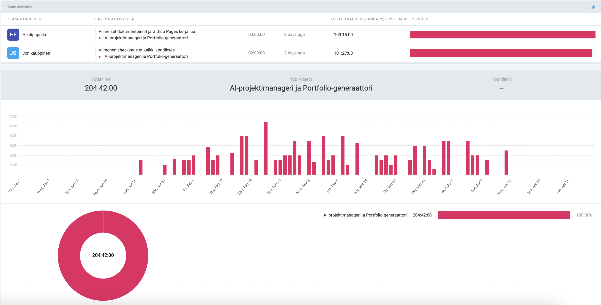

# Summary
 
## Project Overview
 
The AI Project Manager & Portfolio Generator is a microservice-based web application that automates the documentation and analysis of GitHub repositories using AI. The system fetches repository data through the GitHub API, analyses it using Google Gemini 2.5 Flash, and generates professional documentation — including README files, project analyses, next-step suggestions, and portfolio descriptions.
 
The project was developed by a 2-person student team (Joni — backend, Heidi — frontend) over approximately 10 weeks with a total budget of €0.
 
---
 
## Key Results
 
All planned MVP features were successfully implemented and verified:
 
- **4 microservices** deployed via Docker Compose (GitHub Service, Analysis Service, Documentation Service, Portfolio Service)
- **All backend tests passed** — unit tests for the database module and integration tests for all four services
- **Caching reduced AI API calls by ~85%** — Gemini free tier limits (250 req/day) were never exceeded during normal use
- **AI-generated content quality** — README files averaged ~5,200 characters, portfolio descriptions ~1,050 characters, all assessed as usable without manual editing
- **AI context awareness demonstrated** — during testing, the model correctly identified missing test coverage in `facebook/react` by analysing the file structure alone, without being explicitly told
 
---
 
## Development Process
 
Development followed an iterative approach across five phases:
 
1. **Planning** — project ideation, technology selection, architecture design
2. **Core infrastructure** — GitHub API integration, Docker setup, database schema
3. **AI integration** — Gemini API, prompt engineering, all analysis endpoints
4. **Database integration** — shared SQLite module across all four services, Docker volume persistence
5. **Documentation and testing** — project report, test runs, video presentation
 
---
 
## Key Learnings
 
- Aggressive caching is essential when working with rate-limited external APIs — a simple time-based cache reduced API costs significantly without adding complexity
- Microservice architecture adds overhead for small teams; a modular monolith would have been faster to build at MVP scale, though the architecture positions the project well for future scaling
- Free AI tools (Gemini 2.5 Flash) proved sufficient for all use cases — the quality gap between free and paid models was smaller than expected
 
---
 
## Future Development
 
The most impactful next steps would be:
 
- Migrate from the deprecated `google.generativeai` package to `google.genai`
- Replace SQLite with PostgreSQL for production-grade concurrent write support
- Add JWT-based user authentication
- Implement a CI/CD pipeline with automated test execution
- Support for multiple repositories per user
- Advanced analytics dashboards
- Improved AI accuracy with fine-tuned models
- Export to multiple formats (PDF, portfolio sites)

And much more...
 
---
 
## Time Tracking
 
 

